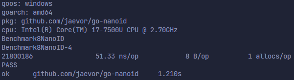
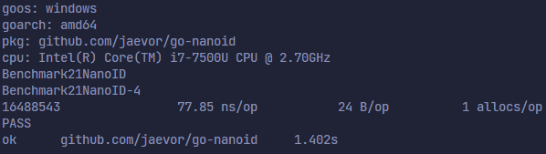
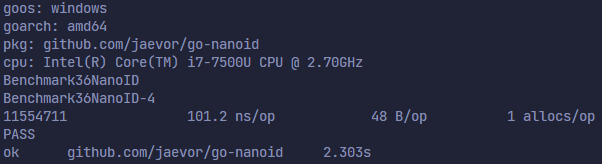
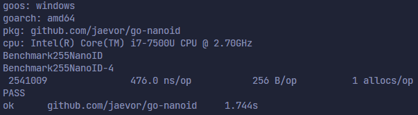

# **go-nanoid**

[](https://github.com/IndexStorm/nanoid-go/actions)
[](https://github.com/IndexStorm/nanoid-go/actions)
[](https://github.com/IndexStorm/nanoid-go/issues)
[](https://github.com/IndexStorm/nanoid-go/blob/master/go.mod)
[](https://pkg.go.dev/github.com/IndexStorm/nanoid-go)

[This module](https://pkg.go.dev/github.com/IndexStorm/nanoid-go) is a Go
implementation of [ai/nanoid](https://github.com/ai/nanoid).

```
go get -u github.com/IndexStorm/nanoid-go
```

```go
import (
	"github.com/IndexStorm/nanoid-go"
	"log"
)

func main() {
	// The canonic NanoID is nanoid.Standard(21).
	canonicID, err := nanoid.Standard(21)
	if err != nil {
		panic(err)
	}

	id1 := canonicID()
	log.Printf("ID 1: %s", id1) // eLySUP3NTA48paA9mLK3V

	// Makes sense to use CustomASCII since 0-9 is ASCII.
	decenaryID, err := nanoid.CustomASCII("0123456789", 12)
	if err != nil {
		panic(err)
	}

	id2 := decenaryID()
	log.Printf("ID 2: %s", id2) // 817411560404
}
```

# Note
This is a restored version of github.com/jaevor/go-nanoid.

This module's functions use an internal buffered slice of random bytes, and thus
also a mutex. This slight overhead of memory allows it to be very efficient, but
may not be ideal if you are only generating an ID every now and then.

# Security

- [Comparison of Nano ID and UUID (V4)](https://github.com/ai/nanoid/blob/main/README.md#comparison-with-uuid)
- [NanoID collision calculator](https://zelark.github.io/nano-id-cc/)
- [More](https://github.com/ai/nanoid/blob/main/README.md)

## Benchmarks

All benchmarks & tests are in [nanoid_test.go](./nanoid_test.go).

These are all benchmarks of `nanoid.Standard(#)`

| # of characters & # of IDs | benchmark screenshot              |
| -------------------------- | --------------------------------- |
| 8, ~21,800,000             |    |
| 21, ~16,400,000            |   |
| 36, ~11,500,000            |   |
| 255, ~2,500,000            |  |

## Credits & references

- [Original reference](https://github.com/ai/nanoid)
- [Older Go implementation of NanoID](https://github.com/matoous/go-nanoid)

## License

[GNU General Public License v3.0](./LICENSE)
